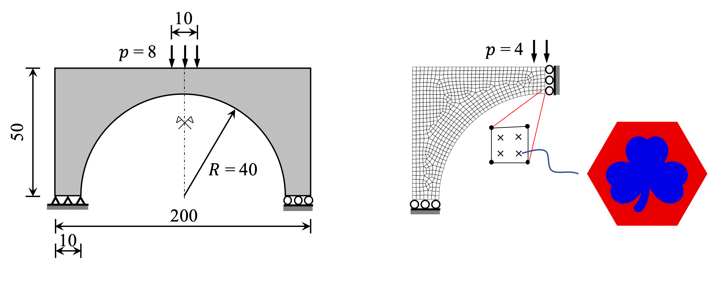
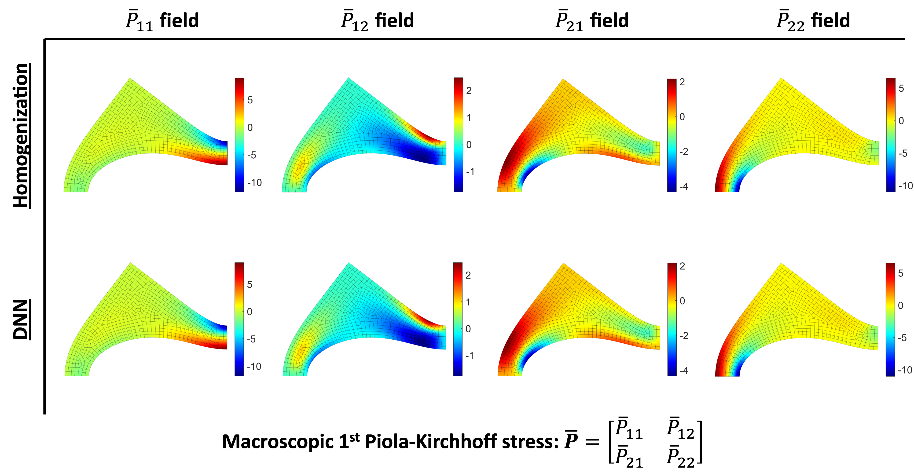

# Machine Learning Surrogates for Finite Strain Multiscale Analysis
A deep neural network (DNN) model is trained for predicting the material mapping from macroscopic strain tensor to stress and material tangent tensors.

## Dependency
- Matlab

## Benchmark
The DNN can be used as a materail subrountine for FE^2^ analysis of multiscale structures composed of periodic hyperelastic microstructures. The below example show the defromed shapes of ar arch example from DNN and homogenization:





**To test DNN model, run**
```
matlab dnn_material_test.py
```
